<div align="center">

# Yui Codex Pet

A desktop pet that mirrors what your **Claude Code** and **Codex** agents are doing.

**English** · [한국어](README.ko.md) · [日本語](README.ja.md) · [简体中文](README.zh-CN.md)

</div>

A small character lives on your desktop and shows what your coding agent is doing —
**Claude Code** and **Codex** both. When the agent starts working, she starts working.
When it stops and waits for your answer, she turns and waits too. When something fails,
you see it from across the room without switching windows.

The window is transparent and always on top, so it sits over whatever you are doing
without covering it. Built with **PySide6** (Qt) on Windows; the hooks that feed it run
in WSL.

<p align="center">
  
</p>
<p align="center"><sub>Real capture. <b>Working</b> shows the project name and elapsed time, <b>waiting</b> turns orange, an <b>error</b> turns red, and <code>≡ N</code> appears when several sessions are running at once.</sub></p>
<p align="center">
  
  &nbsp;
  
  <br><sub>Nine animation states, sixteen look directions.</sub>
</p>

---

## The status it mirrors

Claude Code writes its phase to a small file through a hook; Codex needs no setup at all,
because the overlay reads the logs Codex already keeps. Either way the overlay polls and
plays the matching animation.

| Your agent | The pet | |
|---|---|:---:|
| idle, or no session open | relaxes | 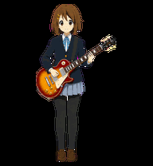 |
| working | works away | 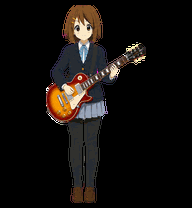 |
| waiting for your input | looks over and waits | 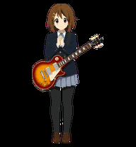 |
| reviewing, wrapping up | reads through | 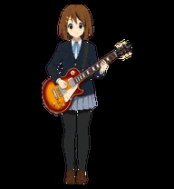 |
| hit an error | reacts | 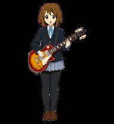 |
| switching tasks | runs across | 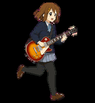 |
| greeting you | waves | 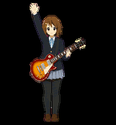 |

Run four sessions and you get one pet, not four. The overlay ranks them
`waiting > failed > working > done > idle` and shows the one that needs you soonest,
with a session count in the corner.

## The cast

Five characters are drawn as one set: same atlas format, same nine states, same timing
table. Right-click to switch between the ones you have art for.

<p align="center">
  
</p>

| | Pet | Identity | Package |
|:---:|---|---|---|
|  | **Hirasawa Yui** | right-handed Gibson Les Paul | `pets/yui/` |
| 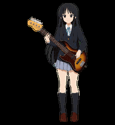 | **Akiyama Mio** | left-handed sunburst Jazz Bass | `pets/mio/` |
| 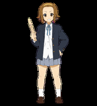 | **Tainaka Ritsu** | drumsticks, Mellow Yellow Hipgig kit | `pets/ritsu/` |
| 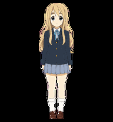 | **Kotobuki Tsumugi** | KORG TRITON Extreme 76-key | `pets/tsumugi/` |
| 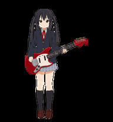 | **Nakano Azusa** | Candy Apple Red Fender Mustang | `pets/azusa/` |

<details>
<summary><b>All nine states, per character</b></summary>
<p align="center">
  
  
  
  
  
</p>
<p align="center"><sub>idle · running-right · running-left · waving · jumping · failed · waiting · active-work · review</sub></p>
</details>

The `pet.json` manifests are here so you can read the package format. The spritesheets
are not; see [Bring your own sprite](#bring-your-own-sprite).

## What else it does

Besides mirroring the agent, the pet has a life of its own and a few things it can do
for you.

**On its own.** It wanders across the screen when nothing is happening, blinks at
irregular intervals, climbs onto the top edge of your windows and walks along them, and
scales the screen edges. Grab it and it runs in the direction you drag; let go while
moving and it flies off on a real arc, bounces at the edge of the screen, and settles.

**It looks at you, but not constantly.** Sixteen look directions, given for three to five
seconds when something happens — the cursor arriving, a click, a status change — and never
while you're typing. Continuous tracking reads as staring, so it doesn't do that.

**When you ask.** Right-click for the menu: wave, jump, climb a wall, start a Pomodoro
(25 on, 5 off), switch pets, open the music player. Everything else lives in a settings
window — language, size, opacity, click behaviour, which autonomous behaviours are on,
dialogue and voice, music folders, agent-status options. It also sits in the system tray,
which is how you get click-through back off once it's on.

**Music.** It plays audio from your own folders, with a player window: search, shuffle, and
filtering by song, instrumental or background music. Music ducks while the pet speaks.

**Three languages.** Korean, English and Japanese for the interface *and* the pet's own
dialogue, switched live with no restart.

**Speech bubbles.** The bubble carries the task title and a line of detail.
`privacyMode` is on by default, so it describes the tool action rather than quoting your
conversation. Turn it off in `config.json` if you would rather see the real text. Set
`showJapanese` and the bubble carries a Japanese line under the Korean one.

**Fullscreen.** It hides itself when a fullscreen app takes over, and comes back after.

## How it works

```
Claude Code hook ──▶ sessions/<source>/<session_id>.json   (a small PetState file)
                                │   (each session writes its own)
                                ▼
                     overlay polls and aggregates by priority
                (waiting > failed > working > done > idle)
                                ▼
                       animated pet + speech bubble
```

```
PetState = {source, session_id, phase, title, detail, transcript, ts, expires_at?}
phase    = idle | working | waiting | done | failed
```

Nothing about that format is Claude-specific. Anything that can write a JSON file can
drive the pet, which is what the CLI below does.

## Install

```bash
./install.sh          # deploys the overlay and registers the Claude Code hooks
./install.sh --dry-run
```

You need Python and PySide6 on the Windows side; the hooks run in WSL. Existing hooks in
your `settings.json` are preserved, and `--uninstall` takes it all back out.
`overlay/README.md` has the details.

## Drive it from your own scripts

The bundled `yui` CLI writes the same `PetState`, so any long-running job can talk to
the pet:

```bash
yui start "training"                     # switches to working
yui done  "training" "3 epochs finished" # green check, then a wave
yui fail  "build"    "tests failed"      # red
yui wait  "needs a decision"             # orange, looks over at you
yui clear                                # back to idle

# or wrap a command; the exit code decides done/fail and is passed through
yui run -t "training" -- python train.py
```

Each caller writes to `sessions/cli/<id>.json`. A CLI job and three Claude Code sessions
coexist without stepping on each other.

## Switching pets

Right-click the pet, then **펫 바꾸기** (*Change pet*). The choice is saved to
`config.json`:

```jsonc
{ "pet": "" }        // "" = the default sheet at the deploy root
{ "pet": "ritsu" }   // = pets/ritsu/spritesheet.webp
```

The overlay finds packages by scanning the deployed `pets/*/` for a manifest and a sheet:

```text
~/.yui-pet/
├── spritesheet.webp        ← default pet, at the deploy root
├── config.json
└── pets/
    ├── mio/{pet.json, spritesheet.webp}
    ├── ritsu/{pet.json, spritesheet.webp}
    └── …
```

A manifest is five fields:

```json
{
  "id": "ritsu",
  "displayName": "Tainaka Ritsu",
  "description": "…",
  "spriteVersionNumber": 2,
  "spritesheetPath": "spritesheet.webp"
}
```

Drop in a folder with those two files and it appears in the menu. No code change, and no
per-pet tuning: every pet shares one timing table and one `lines.json`.

## Bring your own sprite

The runtime loads a Codex Pet v2 atlas named in `pet.json`. **That art is not shipped
here.** `SPRITE_SPEC.md` has the full spec — 1536×2288, 8×11 cells of 192×208, nine state
rows and two look rows — so you can draw your own character, or point the loader at any
sheet you have the rights to.

## What's in here

| Path | |
|---|---|
| `overlay/yui_pet.py` | the PySide6 transparent overlay |
| `overlay/config.json`, `lines.json` | display settings and editable dialogue |
| `hooks/` | status writers shared by Claude Code and Codex, recording each session's `PetState` |
| `tools/` | hook registration helper, the `yui` CLI, a sprite upscaler |
| `pets/*/pet.json` | package manifests for the five characters |
| `preview/` | state animations, look directions, cast roster |
| `SPRITE_SPEC.md` | the atlas spec, for drawing your own |
| `install.sh` | one-command deploy |
| `README.{ko,ja,zh-CN}.md` | the same README in Korean, Japanese, and Simplified Chinese |

## Inspiration

Codex Pet v2, and the desktop-mascot tradition that Shimeji and its descendants come
from. The overlay, the hook-driven status architecture, and the animation set are my own
work on top of that idea.

## License and assets

**Source code** is MIT © 2026 SeongJin Kim (see `LICENSE`).

**The font**, `PretendardVariable.ttf` by Kil Hyung-jin, is under the SIL Open Font
License.

**The character art** is a different matter. Hirasawa Yui, Akiyama Mio, Tainaka Ritsu,
Kotobuki Tsumugi and Nakano Azusa are from *K-ON!* and belong to their rights holders
(© Kakifly · Houbunsha · TBS · Kyoto Animation). The drawings here are fan-made and
non-commercial, are offered under no license at all, and should not be reused. Only
low-resolution preview animations are published; the spritesheets themselves are not
distributed. Draw your own character instead — that is what `SPRITE_SPEC.md` is for.
This project is unaffiliated with the rights holders and is not endorsed by them.
