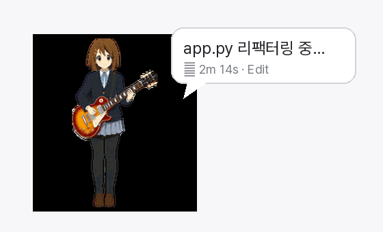

# Yui Codex Pet — a Claude Code desktop pet (engine)

A transparent, always-on-top **desktop pet** that reacts to what your **Claude Code**
agent is doing *right now* — idle, working, waiting for your input, reviewing, or
failed. It follows your cursor with its gaze, can be dragged anywhere, pops speech
bubbles with the current task, and merges several concurrent sessions by priority.

Built with **PySide6** (Qt) on Windows, driven by Claude Code hooks running in WSL.

<p align="center">
  
</p>
<p align="center">
  
  &nbsp;
  
</p>
<p align="center"><sub>Top: the pet surfaces your agent's current task in a speech bubble and animates its phase
(illustrative composite of the overlay UI, built from the real sprites). Bottom: the animation states and the 16 look directions.</sub></p>

---

## What it does — it mirrors your agent's live status

Each Claude Code session writes its phase through a hook; the overlay picks it up and
animates the matching state:

| When your agent is… | Yui… | |
|---|---|:---:|
| **idle / no session** | relaxes |  |
| **actively working** | works away |  |
| **waiting for your input** | looks over and waits |  |
| **reviewing / wrapping up** | reads through |  |
| **hit an error** | reacts |  |
| **switching tasks** | runs across |  |
| **greeting you** | waves |  |

## Features

- **Live agent status** — hooks report each session's phase; the pet animates it in real time.
- **Multi-session priority** — with several Claude Code sessions open, it shows the one that
  needs you most: `waiting > failed > working > done > idle`.
- **Speech bubbles** — surfaces the current task's title/detail so you can glance and know.
- **Cursor-follow gaze** — sixteen look directions track your mouse around the screen.
- **Drag-to-move · transparent · always-on-top · system tray** — stays out of the way.
- **Swappable pets** — right-click to switch characters (Codex Pet v2 package format).

## How it works

```
Claude Code hook ──▶ sessions/<source>/<session_id>.json   (a small PetState file)
                                │   (each session writes its own)
                                ▼
                     overlay polls and aggregates by priority
                (waiting > failed > working > done > idle)
                                ▼
                       animated pet + speech bubble
```

`PetState = {source, session_id, phase, title, detail, transcript, ts, expires_at?}`

## Run it

```bash
./install.sh          # deploys the overlay + registers the Claude Code hooks
./install.sh --dry-run
```

The overlay needs Python + PySide6 on the Windows side; the hooks run in WSL. See
`claude-overlay/README.md` for details.

## What's in here

- `claude-overlay/yui_pet.py` — the PySide6 transparent overlay (renderer).
- `claude-overlay/config.json`, `lines.json` — display settings and editable dialogue.
- `hooks/` — the Claude Code hooks that record per-session `PetState`.
- `tools/` — hook registration helper, a `yui` notification CLI, a sprite upscaler.
- `pets/*/pet.json` — pet package manifests (Codex Pet v2 format).
- `SPRITE_SPEC.md` — the full sprite-atlas spec so you can **draw your own** character.
- `install.sh` — one-command deploy.

## Bring your own sprite

The runtime loads a Codex Pet v2 atlas (`spritesheet.webp`) named in `pet.json`. That
art is **not shipped here** — follow `SPRITE_SPEC.md` to make your own (1536×2288 atlas,
8×11 cells, 9 states, 16 look directions), or point it at any sheet you have rights to.

## Inspiration

Inspired by **Codex Pet v2** and the classic desktop-mascot tradition (Shimeji and
friends). The overlay, the hook-driven live-status architecture, and the animation set
are my own work on top of that idea.

## License & assets

- **Source code** — MIT © 2026 SeongJin Kim (see `LICENSE`). Please keep the credit.
- **Font** — `PretendardVariable.ttf` by Kil Hyung-jin, under the SIL Open Font License.
- **Character art (previews & sprites)** — these depict **Hirasawa Yui** from *K-ON!*,
  a character owned by its rights holders (© Kakifly · Houbunsha · TBS · Kyoto Animation).
  The drawings here are **fan-made and non-commercial**, are **not offered under any
  license**, and shouldn't be reused — please make your own character instead. This
  project is unaffiliated with and not endorsed by the rights holders.
